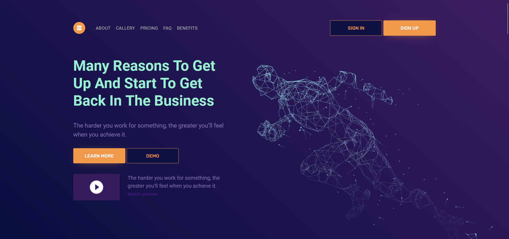

# Landing Page Data Processing Company

 It is a responsive landing page for a data processing company  with a modern dark UI look from [arshakir](https://dribbble.com/arshakir).

 - This Site made  using HTML5, CSS3, JavaScript.

#### Demo Image 🖼:

## LIVE DEMO.[TRY NOW](https://hawra-alramadan.github.io/Landing-Page-Data-Processing-Company/) ♥

## Features

 - Fully Responsive Base Theme
 - Social Icons 
 - Google Font 
 - Footer navigation
 - Newsletter subscription 
 - Free & Automatic Hosting with GitHub Pages 

### 💡NOTE :
 This website is just for practice.
 

u can use It anywhere, just by giving credit to effortfor to the code [hawra-alramadan](https://github.com/hawra-alramadan). and for the design [arshakir](https://dribbble.com/arshakir).

## Acknowledgements

 - [Awesome Readme Templates](https://awesomeopensource.com/project/elangosundar/awesome-README-templates)
 - [Awesome README](https://github.com/matiassingers/awesome-readme)
 - [How to write a Good readme](https://bulldogjob.com/news/449-how-to-write-a-good-readme-for-your-github-project)

## Authors

 [hawra-alramadan](https://github.com/hawra-alramadan)

# 🔐LICENSE:
©  Copyright 2022 

